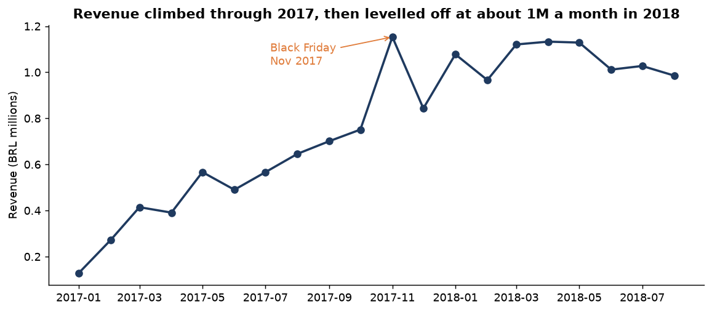
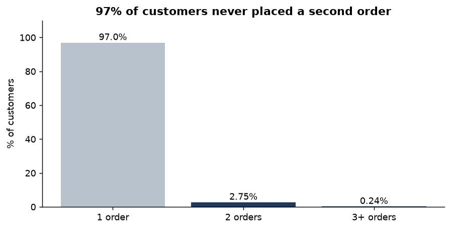
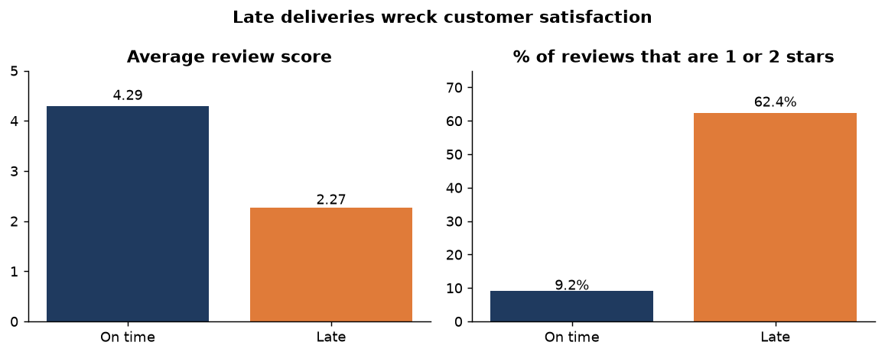
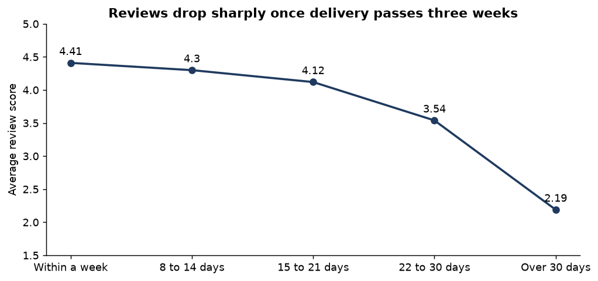
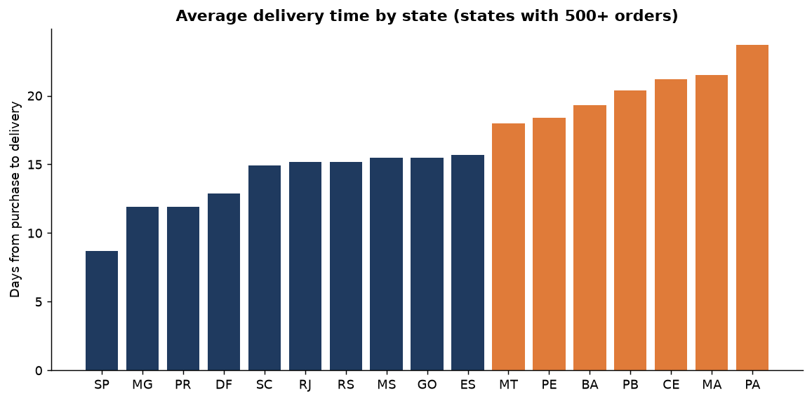
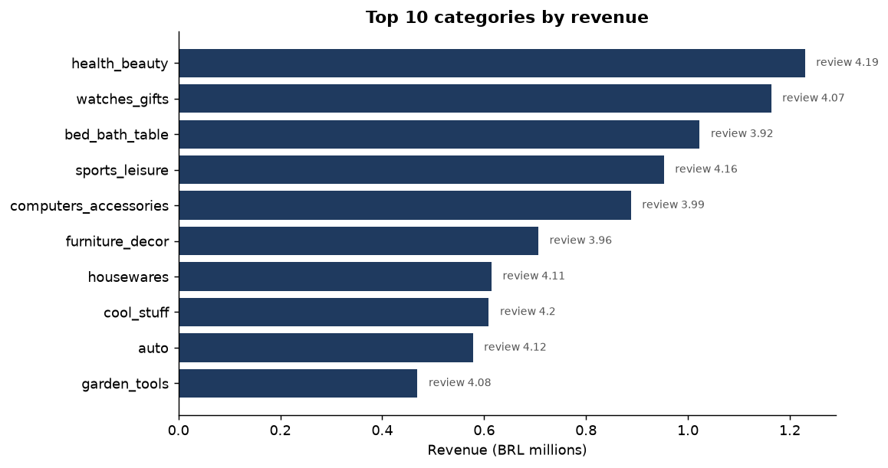
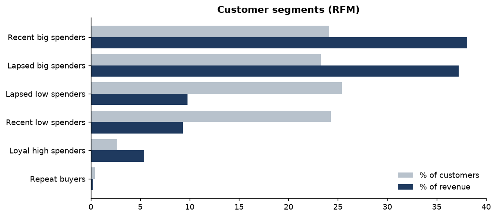
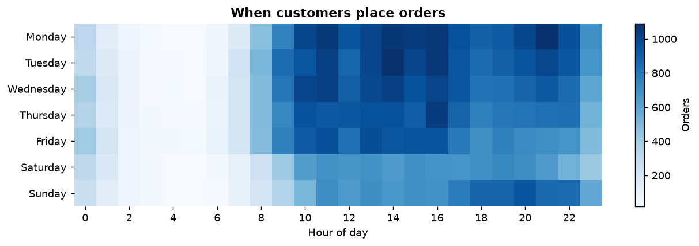

# Olist Ecommerce Sales and Customer Analysis

An analysis of about 96,000 delivered orders from Olist, a Brazilian online marketplace, covering January 2017 to August 2018. I used SQL to answer questions an ecommerce business actually asks: where revenue comes from, whether customers come back, and what drives bad reviews.

## Key findings

**1. Revenue climbed through 2017, then levelled off.** Monthly revenue went from about 127K BRL in January 2017 to over 1.1M in November 2017, then held at roughly 1M a month through 2018. Black Friday (24 November 2017) brought in 1,147 orders in a single day, about six times a normal day.



**2. Almost nobody buys twice.** 97% of the 93,096 customers placed only one order. The 3% who returned brought in 5.6% of revenue. Growth so far has come almost entirely from new customers, which is expensive to sustain.



**3. Late delivery is the biggest driver of bad reviews.** Only 6.7% of orders arrived late, but those orders averaged 2.27 stars against 4.29 for on time orders, and 62% of them got a 1 or 2 star review. Reviews stay above 4 stars for anything delivered within three weeks, then fall to 2.19 for deliveries over 30 days.




**4. Customers far from São Paulo wait twice as long and pay more for shipping.** São Paulo state averages 8.7 days from purchase to delivery. Northern and northeastern states like Pará, Maranhão and Ceará average over 21 days, and freight makes up 26 to 30% of their order value compared with 18% in São Paulo.



**5. A few categories carry the business.** Health and beauty, watches and gifts, and bed, bath and table are the top three by revenue. Bed, bath and table has the most orders but one of the weaker review scores (3.92), and office furniture has the lowest of the top 15 (3.52).



**6. Big spenders who have gone quiet are worth chasing.** RFM segmentation shows "lapsed big spenders" (last order about a year ago, high order value) make up 23% of customers and 37% of revenue, almost as much as recent big spenders.



**7. People shop on weekdays during working hours.** Monday and Tuesday are the busiest days, orders peak between 10am and 4pm, and Sunday evenings are busier than Saturday evenings. 77% of orders are paid by credit card, with an average of 3.5 instalments.



## Recommendations

1. **Fix delivery before spending more on marketing.** Flag orders at risk of running late and contact the customer early. For northern and northeastern states, set honest delivery estimates or look for regional carriers or warehousing.
2. **Build a second purchase programme.** With 97% one time buyers, even moving repeat purchases from 3% to 5% would add meaningful revenue. Target first time buyers with a follow up offer within 30 to 60 days.
3. **Win back lapsed big spenders** with personalised offers in their past categories.
4. **Look into quality in bed, bath and table and office furniture**, where review scores lag.
5. **Time promotions for weekday late mornings and Sunday evenings**, and plan stock and delivery capacity well ahead of Black Friday.

## Method

- **Cleaning:** kept only delivered orders from complete months (Jan 2017 to Aug 2018), used `customer_unique_id` to count real customers (a customer gets a new `customer_id` for each order), and kept the latest review where an order had more than one.
- **Late delivery:** delivered more than one day after the estimated delivery date.
- **RFM:** recency and spend scored into quartiles. Because 97% of customers have one order, frequency is split into one order versus two or more.
- **Currency:** all values are in Brazilian reais (BRL) and include freight unless stated.

## Project structure

```
sql/                 one query per business question
run_analysis.py      runs every query with DuckDB and saves results to outputs/
make_charts.py       builds the charts in charts/ from those results
outputs/             query results as CSV
charts/              charts used in this README
```

## How to run

1. Download the dataset from [Kaggle: Brazilian E-Commerce Public Dataset by Olist](https://www.kaggle.com/datasets/olistbr/brazilian-ecommerce) and put the CSVs in `data/`.
2. `pip install -r requirements.txt`
3. `python run_analysis.py`
4. `python make_charts.py`

## Tools

SQL (DuckDB), Python, pandas, Matplotlib
